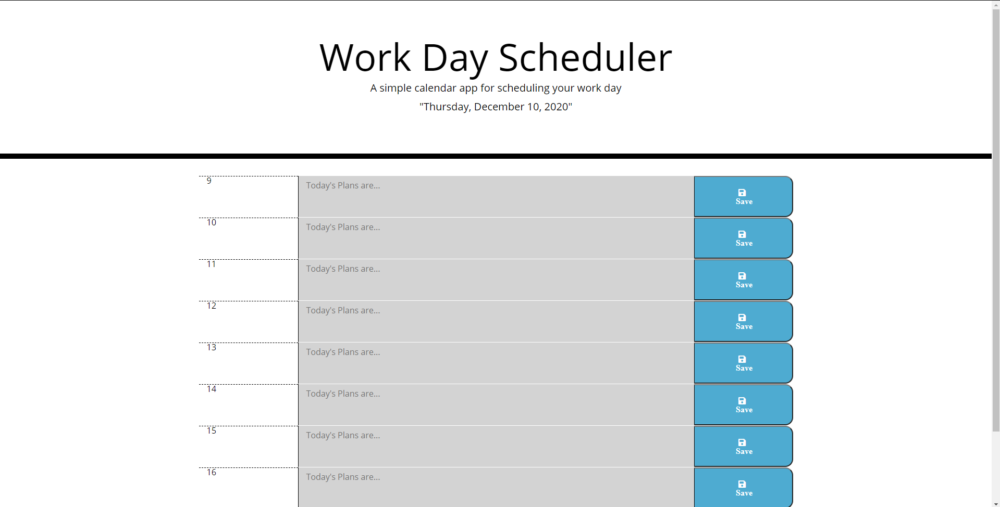

# Day Planner

## Overview

Here is a day planner to help organize your daily life by business hour. When an event is in progress, it will be highlighted red. When an event has passed, it will be highlighted grey and when a even is upcoming it will be highlighted red. You can save your events so even if you remove the browser and reopen it, everything you saved will still be there. Start organizing your day with this app today.

## Description

This application was made heavily in javascript and primarily Jquery. A majority of the html is done through HTML DOM in the javascript page where I added both the elements, classes, and ids to the elements. The library that is being used to display and calculate date and time in this application is luxon.js.

### Application

https://latinobull.github.io/Day-Planner/
